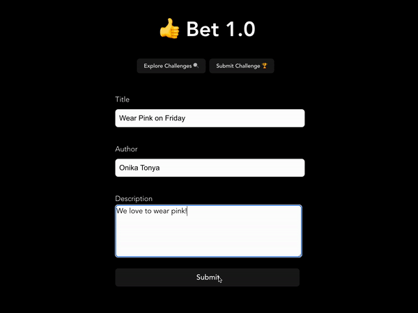

# Bet Exemplar Lab

## Overview

Bet is a forum designed for Gen Z thrill-seekers where users can post challenges for other users. Users can take on a challenge by clicking the “Bet” button.

The user is able to perform all four CRUD operations: create a new challenge, read previous challenges, update a challenge, and delete a challenge.

## Lab Screenshot



## Setup

### Dependencies

This project was bootstrapped with Create React App with the following dependencies:

* [Create React App](https://www.npmjs.com/package/create-react-app)
* [React](https://www.npmjs.com/package/react)
* [React-DOM](https://www.npmjs.com/package/react-router-dom) (v.6)
* [Supabase-JS](https://www.npmjs.com/package/@supabase/supabase-js)

---

### Install Dependencies

Before installing dependiencies, you will need `node` and `npm` installed globally on your machine by installing  [NodeJS](https://nodejs.org/en/download/) onto your machine.

To install the dependencies, run:

```sh
npm install
```

Alternatively, you can install the dependencies individually:

```sh
npm install react
npm install react-dom
npm install react-scripts
npm install @supabase/supabase-js
npm install react-router-dom@6
npm install web-vitals
npm install @testing-library/jest-dom
npm intall @testing-library/react
```

### Run Bet

In the `client` directory, run the following in your terminal:

```sh
npm start

```

Visit the web application in the browser:

```html
http://localhost:3000/
```

---

*Last Updated: December 2022*